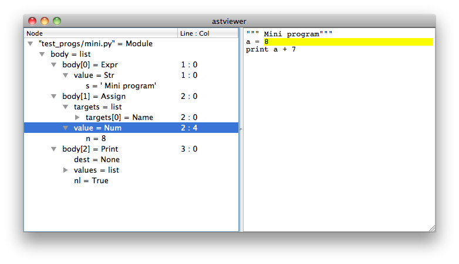

astviewer
=========

Graphical User Interface for viewing Python Abstract Syntax Trees.



#### Installation:

First install
	    [PyQt](https://www.riverbankcomputing.com/software/pyqt/download5)
    or
	    [PySide](http://wiki.qt.io/Category:LanguageBindings::PySide::Downloads)

AstViewer automatically detects which Qt bindings are installed. If both bindings are installed
it prefers PyQt over PySide. You can force AstViewer to use a certain binding by setting the
`QT_API` environment variable to `pyqt5`, `pyqt4`, or `pyside`.

Then install AstViewer with:

    %> pip install astviewer

or use the installer:

    %> python setup.py install


#### Usage:
	
Command line example:
	
    %> pyastviewer myprog.py
	
Examples to use from within Python:

```python
	>>> from astviewer.main import view
	>>> view(file_name='myprog.py')
	>>> view(source_code = 'a + 3', mode='eval')
```

#### Further links:

The [Green Tree Snakes documentation on ASTs](http://greentreesnakes.readthedocs.org/) is available
for those who find the [Python ast module documentation](http://docs.python.org/3/library/ast) too brief.
