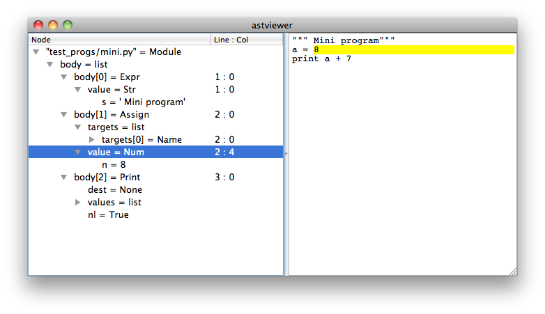

astviewer
=========

Graphical User Interface for viewing Python Abstract Syntax Trees.



### Installation:

To install Astviewer use pip:

    %> pip install astviewer

It should automatically install PyQt5 as well. 


### Usage:
	
Command line example:
	
    %> astviewer myprog.py
	
Examples to use from within Python:

```python
	>>> from astviewer.main import view
	>>> view(file_name='myprog.py')
	>>> view(source_code = 'a + 3', mode='eval')
```

### Further links:

The [Green Tree Snakes documentation on ASTs](http://greentreesnakes.readthedocs.org/) is available
for those who find the [Python ast module documentation](http://docs.python.org/3/library/ast) too brief.
